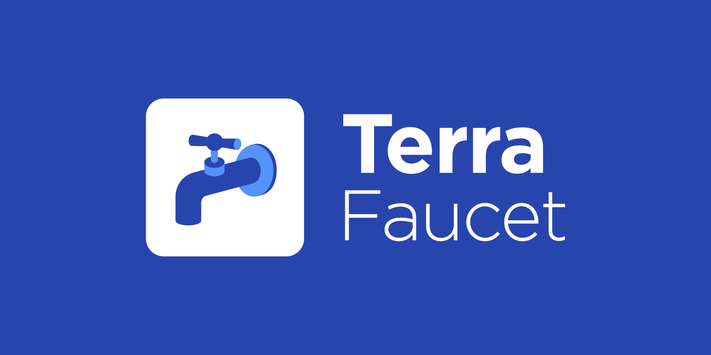

# Terra Testnet Faucet



Terra Testnet Faucet is a client tool that allows anyone to easily request a nominal amount of Terra or Luna assets for testing purposes. This app needs to be deployed on a Terra testnet full node, because it relies on using the `terracli` command to send tokens.

**WARNING**: Tokens recieved over the faucet are not real assets and have no market value.

This faucet implementation is a fork of the [Cosmos Faucet](https://github.com/cosmos/faucet).

## Get tokens on the Terra Soju Testnet

Using the testnet is really easy. Simply go to https://faucet.terra.money and input your testnet address. 

If you don't have a testnet address, or don't know what the Soju testnet is, please refer to [setup docs](https://github.com/terra-project/core/docs/guide/README.md) for more info. 
 

## Deploying your own faucet

The faucet app offers both a backend and a frontend. Here we offer instructions to deploy both. 

### Deploy faucet server

You must have `terrad` installed and running on your machine before deploying the faucet server. Follow [setup docs](https://github.com/terra-project/core/docs/guide/README.md) to deploy Terrad if you haven't already. 

#### Get reCAPTCHA Key

Go to the [Google reCAPTCHA Admin](https://www.google.com/recaptcha/admin) and create a new reCAPTCHA site. For the version of captcha, choose `reCAPTCHA v2`.

In the file `./frontend/src/views/Faucet.vue` on line 60, change the `sitekey` to your new reCAPTCHA client side integration site key.

```
sitekey: "6LdqyV0UAAAAAEqgBxvSsDpL2aeTEgkz_VTz1Vi1"
```

#### Set ENV Variables

The faucet requires 4 different enviroment variables to set in order to function. They are: 

1. `KEY`, the name of your faucet account.
2. `NODE`, the address of your `terrad` node (probably don't have to change)
3. `CHAIN`, the chain id of the testnet.
4. `PASS`, the password of your faucet account.

Change the default settings on the main directory's `env.json` file to set the relevant variables. Otherwise, just leave the variables alone, and it will connect to the most recent version of the Soju testnet. 

#### Build

You need to have Golang and Yarn/Node.js installed on your system.

```
go get $GOPATH/src/github.com/terra-project/faucet
cd $GOPATH/src/github.com/terra-project/faucet
dep ensure

cd frontend
yarn && yarn build
cd ..
```

#### Run

This will run the faucet on port 8080. It's highly recommended that you run a reverse proxy with rate limiting in front of this app.

```
go run faucet.go RECAPTCHA_SERVER_SIDE_SECRET
```

### Deploy faucet client (frontend)

Deploying the faucet frontend is simple. It is a trivial React app. 

From the topmost directory, run: 

```
cd ./frontend
npm install
npm start 
```

This should start the faucet web server on `localhost:3000`.

Read the [frontend docs](./frontend/README.md) for more detailed instructions. 


### Optional: Caddy

Included in this repo is an example `Caddyfile` that lets you run an TLS secured faucet that is rate limited to 1 claim per IP per day. Change the URL to best fit your purposes. 
